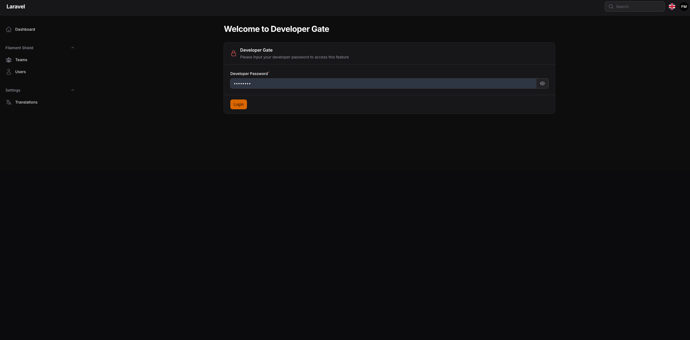
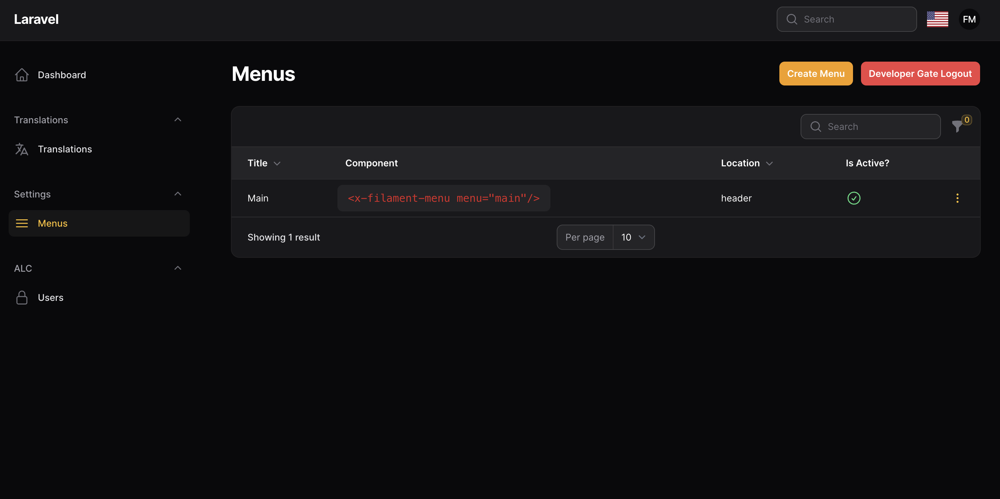

# Filament developer gate

Secure your selected route by using a middleware with static password for developers only

## Screenshots





## Installation

```bash
composer require tomatophp/filament-developer-gate
```

finally reigster the plugin on `/app/Providers/Filament/AdminPanelProvider.php`

```php
$panel->plugin(\TomatoPHP\FilamentDeveloperGate\FilamentDeveloperGatePlugin::make())
```


## Usage

to secure selected resource or page you can use this trait

```php
use TomatoPHP\FilamentDeveloperGate\Traits\InteractWithDeveloperGate;
```

or you can use the middleware direct on your routes like this

```php
Route::middleware([\TomatoPHP\FilamentDeveloperGate\Http\Middleware\DeveloperGateMiddleware::class])->group(function () {
    Route::get('/dashboard', function () {
        return view('dashboard');
    })->name('dashboard');
});
```

you can add a logout action button to your page or resource by using this trait 

```php
use TomatoPHP\FilamentDeveloperGate\Traits\DeveloperGateLogoutAction;
```

## Publish Assets

you can publish config file by use this command

```bash
php artisan vendor:publish --tag="filament-developer-gate-config"
```

you can publish views file by use this command

```bash
php artisan vendor:publish --tag="filament-developer-gate-views"
```

you can publish languages file by use this command

```bash
php artisan vendor:publish --tag="filament-developer-gate-lang"
```

you can publish migrations file by use this command

```bash
php artisan vendor:publish --tag="filament-developer-gate-migrations"
```

## Support

you can join our discord server to get support [TomatoPHP](https://discord.gg/Xqmt35Uh)

## Docs

you can check docs of this package on [Docs](https://docs.tomatophp.com/plugins/laravel-package-generator)

## Changelog

Please see [CHANGELOG](CHANGELOG.md) for more information on what has changed recently.

## Security

Please see [SECURITY](SECURITY.md) for more information about security.

## Credits

- [Fady Mondy](mailto:info@3x1.io)

## License

The MIT License (MIT). Please see [License File](LICENSE.md) for more information.
